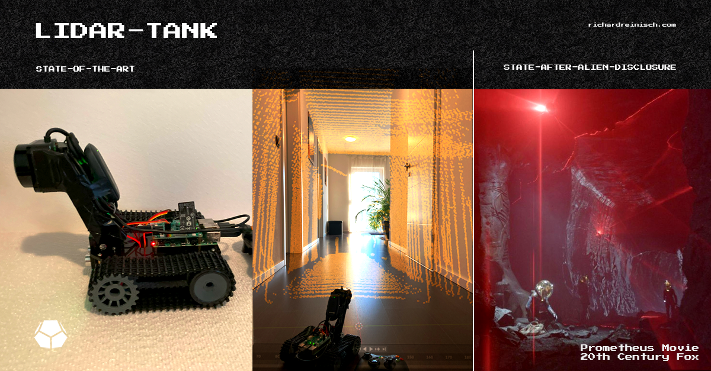
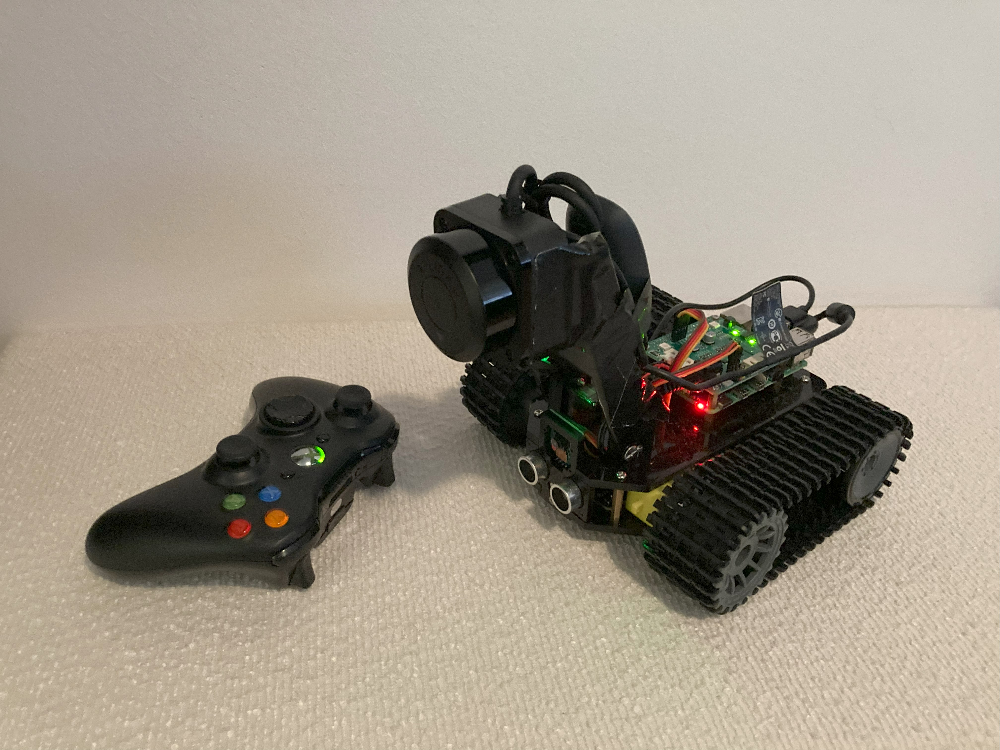

# lidar-tank
Simple LiDAR solution to map cave approximately

## XBOX 360 Controller using Dongle (2025/04)
https://github.com/medusalix/xone?tab=readme-ov-file
https://github.com/medusalix/xpad-noone

## Tank:
* Install packages pi-hardware-pwm, rpi-ws281x from pip, numpy, etc.
* Enable SPI Interface using raspi-config
* Edit /boot/firmware/config.txt, add "dtoverlay=pwm-2chan,pin=12,func=4,pin2=13,func2=4"
* Start sudo pigpiod (alternative?)

## Create a Systemd Service Unit File

Create a service file for your application at /etc/systemd/system/lidar-tank.service:

### Enable and Start the Service

bash
sudo systemctl daemon-reload
sudo systemctl enable lidar-tank.service
sudo systemctl start lidar-tank.service

### Check Service Status

bash
sudo systemctl status lidar-tank.service

### View Logs

bash
journalctl -u lidar-tank.service -f

## PiOS:

https://www.raspberrypi.com/software/

## Tank Robot Kit:

https://github.com/Freenove/Freenove_Tank_Robot_Kit_for_Raspberry_Pi/tree/main

## Setup Firewall (UFW):

https://pimylifeup.com/raspberry-pi-firewall/

## Legal Information

- This tool uses bunch of external libraries, etc. Refer to their respective licenses for compliance.
- Ensure your use case complies with data protection regulations, particularly when handling sensitive or personal information.
- The authors provide no warranty and assume no liability for any issues arising from the use of this tool.
